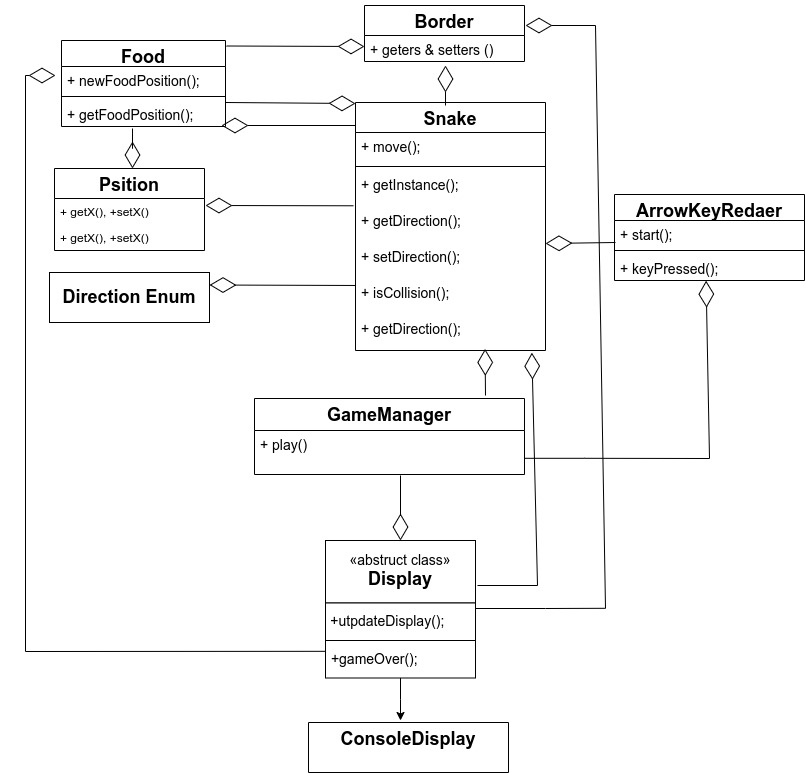

<h1>Snake Game</h1>

This is a console-based implementation of the classic Snake game. The player controls a snake that moves around the board eating food pellets, growing longer with each pellet it eats. The game is over when the snake crashes into a wall or its own body.

<h2>Compiling and Running the Snake Game</h2>

To compile and run this project, please follow these steps:
<ol>
<li>Click on the green "Code" button on this page and select "Download ZIP" to download the project to your computer. Alternatively, you can clone the repository by executing the following command in your terminal or Git command prompt: <code>git clone https://github.com/shltem/Snake.git</code>. This will create a local copy of the repository on your computer.</li>
<li>If you chose to download the ZIP file, extract it to a location on your computer.</li>
<li>If you cloned the repository, navigate to the 'Snake-master/src/main/java' directory in the extracted files or cloned repository.</li>
<li>Open a terminal or command prompt in that directory and run the command <code>javac *.java</code> to compile all the Java files in that directory. If there are any issues with compiling or running the game, make sure that you have Java installed on your computer.</li>
<li>Once the compilation is complete, run the game by executing the command <code>java Main</code> in the same directory.</li>
<li>This should start the game and allow you to play it. </li>
</ol>

There may be issues with the game's display on certain operating systems or console environments due to differences in terminal or command prompt capabilities. 

To control the movement of the snake, use the arrow keys on your keyboard. Be careful not to run into the walls or the snake's own body, or the game will be over!

Future development plans for this Snake game project include adding features such as colored graphics, sound effects, and a score display to enhance the gaming experience. Additionally, I want to work towards a more advanced display of the game

<h2>UML Design Overview</h2>

